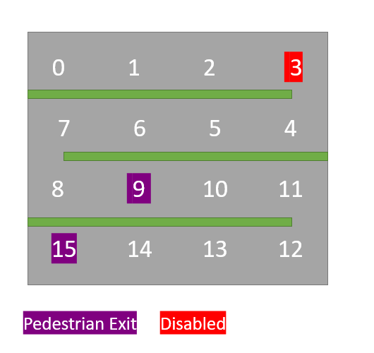

# Parking TDD Kata

You will implement a system to manage parking slots(bays) in a parking area.

- The parking has a square surface (the edge size is given at construction time).
- For example, for an edge=4, the following parking bay indexes exist:
0	1	2	3
7	6	5	4
8	9	10	11
15	14	13	12

!Note: Once an end of lane is reached, then the next lane is reversed (to represent the fact that cars need to turn around)

- In parking area, some bays may be assigned to be Pedestrian Exits, while other can be reserved for cars driven by Disabled people.

- The total number of parking bays does not include the Pedestrian Exits.

- When a new car arrives, you need to assign it a parking bay (if there's one available), or return -1 in case you can't park the car anywhere.
The function parkCar(ch):int is given the first letter of the incoming car brand name, or 'D' if the car is of a disabled man.
For example:
* when a Chrystler wants to enter, you are called parkCar('C')
* when a Mitsubishi wants to enter, you are called parkCar('M')
* when a disabled car wants to enter, you are called parkCar('D')

- When parking a car, you should assign an index which index is the closest (in modulo) to any of the Pedestrian Exists.
For example, if the pedestrian exit is at index 5, and you have indexes 3 and 8 free ==> return 3. **

- When parking a Disabled car, you should prefer the bays reserved for them. If all those bays are full, fall back to the algorithm for parking ant regular car.

- The layout of the parking should be printable in a human-readable format. See the test +javadocs for more details.

- Your JOB: Make the unit tests pass. 
You are NOT allowed to change the existing unit TESTS, but you are allowed to add more, if you want.

Time : 2-4 hours.
